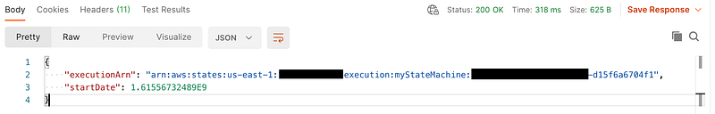
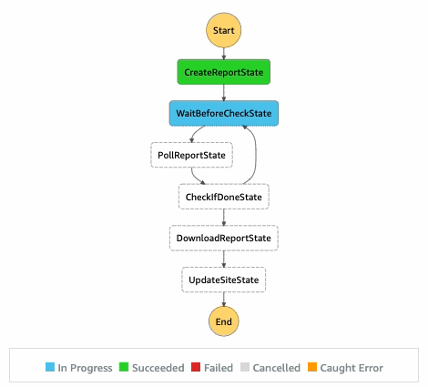

# AWS Step Functions using Serverless Framework

**2024 Update:**  There’s been some updates on the serverless framework since 2021 when I published this originally. While following the steps of my own article in 2024 I noticed a few quirks that one should account for — see the bottom of this article for details.

While I am already fairly familiar with AWS Lambda, the platform for doing serverless computation at Amazon, I was not familiar with the "Step Function" aspect until I was introduced to it at work. To oversimplify a bit: step functions are a way to run multiple lambda functions* sequentially, like a state machine.

## Pros & Cons (vs. one "big" lambda)

Some gains of doing it this way rather than doing one bigger lambda function to handle all concerns are:

* Your code can be organized into smaller, discrete chunks. The  **Single Responsibility Principle**  of SOLID comes to mind.
* Each step in the state machine can have its own retry mechanism which is handled by AWS. A multi-step process that encounters an error midway through can re-attempt just the “middle” operation before continuing on its way rather than having to handle retrying with your own logic and handlers. This reduces the complexity of building your application for you.
* *Steps do not have to just be lambda functions — you can introduce steps like writing to DynamoDB, making a choice based on the payload (without needing a Lambda to do it), or even hitting a web API (_NOTE: the endpoint must be behind an AWS API gateway! Read more_ [_here_](https://docs.aws.amazon.com/step-functions/latest/dg/connect-api-gateway.html)_._). This is done using Amazon’s proprietary “ASL” ([Amazon States Language](https://docs.aws.amazon.com/step-functions/latest/dg/concepts-amazon-states-language.html)). Again, the advantage here is that it reduces complexity for you as you do not need to handle the logic in your lambda code.
* You can execute each lambda in your state machine separately which makes debugging complex sequences a breeze as you can narrow down on a specific step that will likely only deal with one specific service. Consider if you had a lambda that talks to three different services, let’s call them A, B, and C sequentially to get its work done. In order to exercise talking to service B you’d need to give the lambda some input that would first go to A before it actually exercises the part you want (B) only to then again pass the data in to C before giving you a result which would require you to write additional debugging code so you can see what’s happening in the middle. With a state machine step function you can simply call “B” using the input you want and immediately see what it returns.
* You get a useful GUI using the web console to see what step your state machine is on or to review inputs and outputs of previous states (see screenshot below)
* While I haven't explicitly tried this, from what I can tell you should be able to easily mix different lambda runtimes in your state machine. That is, it may make sense to use Go for one function but Ruby for another for example. In a single lambda this would be tricky to accomplish, but since each lambda function in the state machine is its own discrete unit you have the freedom to choose this approach if it make sense for your use case.


GUI for viewing runs of a state machine

Some of the drawbacks are:

* AWS state machines are mandatorily asynchronous — if you wanted to kick off the process through an API gateway, for example, you’d only get an automatic response containing the execution ARN with no way to return any additional details to the client invoking your state machine.
* Learning the proprietary “Amazon States Language” has a learning curve associated with it, though it is not too complicated.
* There are additional AWS costs incurred for using the state machine. As of the time of writing this, it is  [$0.025 USD per 1000 state transitions](https://aws.amazon.com/step-functions/pricing/). It’s not a lot, but it  _is_  an additional cost. Plus, given that spinning up a new lambda run is going to be slower than just calling a function inside your lambda “normally” you’re spending a bit more time and thus more money on running your lambdas. Again, Lambda costs are pretty low so the difference will probably be negligible for most use cases but if you’re building something large it may be a factor to consider.



What you get back if you trigger a state machine using an API gateway.

## Getting Started (using Serverless Framework)

Ideally for anything other than a simple experiment you’d be using  **Infrastructure as Code**  (IaC) to set up your application. The fact that either way, whether you do it through the web console or through IaC you’d still have to write out the ASL “code” to describe your state machine’s steps makes the case for using IaC even a bigger advantage as you’re already writing something anyway. My personal preferred IaC option for something like this would be the Serverless Framework which has an article exactly on how to set up  [step functions](https://www.serverless.com/plugins/serverless-step-functions). To get going, simply add the plugins required via

```bash
npm install --save-dev serverless-step-functions serverless-pseudo-parameters
```

Then in your  `serverless.yml`  file add

```yaml
    plugins:
      - serverless-step-functions
      - serverless-pseudo-parameters
```

In case you’re wondering, the second dependency , “pseudo parameters” just allows us to use shorthands for referencing some resources. It it has nothing specific to do with step functions but makes things easier to write out in serverless configuration.

For the purposes of this article, we’ll create a state machine that runs a report over and over on a timer and updates a public S3 bucket with an HTML table using that data. We will be using an asynchronous reporting API where you kick off a report by making a POST request, it provides you a URL to check the status (which can either be “IN_PROGRESS” or “COMPLETED”) and if completed you will also get a download URL which will contain a CSV file. We want to take that CSV file, turn it into an HTML file with a table and upload it to S3.

All the lambdas you will be using for the various states should be defined as usual in the “functions” section:

```yaml
functions:
  CreateReport:
    handler: create_report_run.handler
  PollReport:
    handler: poll_report.handler
  DownloadReport:
    handler: download_report.handler
  UpdateSite:
    handler: update_site.handler
```

In this case, we’re storing the handlers in separate files called “create_report_run.rb” etc. with a method called “handler”. Since we’re always going to run the same inputs in this case, we don’t need to be concerned about what we’re passing in to the first step.

Now let’s define the actual steps. Let me show you the entire steps section first, then we’ll dissect it:

```yaml
stepFunctions:
  stateMachines:
    RunReport:
      events:
        - schedule: cron(0/1 * ? * * *)
      name: ReportRunner
      definition:
        StartAt: CreateReportState
        States:
          CreateReportState:
            Type: Task
            Resource:
              Fn::GetAtt: [CreateReport, Arn]
            Next: WaitBeforeCheckState
          WaitBeforeCheckState:
            Type: Wait
            Seconds: 10
            Next: PollReportState
          PollReportState:
            Type: Task
            Resource:
              Fn::GetAtt: [PollReport, Arn]
            Next: CheckIfDoneState
          CheckIfDoneState:
            Type: Choice
            Choices:
              - Variable: "$.download_url"
                IsNull: false
                Next: DownloadReportState
            Default: WaitBeforeCheckState
          DownloadReportState:
            Type: Task
            Resource:
              Fn::GetAtt: [DownloadReport, Arn]
            Next: UpdateSiteState
          UpdateSiteState:
            Type: Task
            Resource:
              Fn::GetAtt: [UpdateSite, Arn]
            End: true
  validate: true
```

So firstly we have the “stepFunctions” and “stateMachines” declarations. Key thing to note here is that it is plural — you can have multiple state machines in one serverless project. The next line declares one such state machine: the state machine called “RunReport”. It is triggered by the “events” listed — namely, it is run on a one minute timer based on the cron syntax. We give the state machine a name of “ReportRunner”. At the end we say “validate: true” simply for the serverless step function plugin to validate that our steps line up correctly as it does not do this by default.

So what about the steps themselves? Well, we start off by declaring “StartAt” which tells us which step is the first step in the flow. In this case, our first step is the “CreateReportState” which is defined as following:

```yaml
      CreateReportState:
        Type: Task
        Resource:
          Fn::GetAtt: [CreateReport, Arn]
        Next: WaitBeforeCheckState
```

We reference which Lambda we want using “Resource” and we tell the state machine that the next state is always going to be “WaitBeforeCheckState” where we want to wait a few seconds before checking the status of the report (it won’t finish immediately).

```yaml
      WaitBeforeCheckState:
        Type: Wait
        Seconds: 10
        Next: PollReportState
```

Pretty straightforward — we’re using the “wait” step type to wait 10 seconds before proceeding to the “PollReportState”. Note that our payload from the previous tasks’s output will be the output of this step as well — it just gets passed through.

```yaml
      PollReportState:
        Type: Task
        Resource:
          Fn::GetAtt: [PollReport, Arn]
        Next: CheckIfDoneState
```

Here’s where we’re going to call another lambda that goes out to a web API to check the status if the report has finished running or not. After it runs, it will return the status.

```yaml
      CheckIfDoneState:
        Type: Choice
        Choices:
          - Variable: "$.download_url"
            IsNull: false
            Next: DownloadReportState
        Default: WaitBeforeCheckState
```

This is what really makes the state machine interesting — we want to do one thing if the report is done and another if not. In particular, we want to rely on a payload containing a “download_url” value; if it is not null then we want to proceed to the “DownloadReportState” but if it is null that means the report is not finished running yet so we want to wait and then check again. Since we already have an existing wait step, we can rely on that step again and simply loop back to it by making that the “Default”.

One thing to watch out for is that if the variable you are checking is undefined, the state machine will go into a “cancelled” state.  **The value can be null, but it cannot be undefined.**

```yaml
      DownloadReportState:
        Type: Task
        Resource:
          Fn::GetAtt: [DownloadReport, Arn]
        Next: UpdateSiteState
```

Another lambda to download the report from the “download_url”

```yaml
      UpdateSiteState:
        Type: Task
        Resource:
          Fn::GetAtt: [UpdateSite, Arn]
        End: true
```

And one final lambda to upload everything to an S3 bucket for publishing. Note the “End: true” part since we have no next step after this one. It is a terminal node in our state machine.

Once we deploy this, AWS will show us the following handy diagram for our state machine:


Our state machine in diagram form

In terms of the code in the handler functions, it’s dead simple — our lambda function signature looks like this:

```ruby
def handler(event:, context:)
  # Do something with "event"
  # "event" can be a string, an object, whatever you need
  result = event["my_previous_value"].upcase
  # Whatever we return will be the "event" of the next task
  {
    my_next_value: result
  }
end
```

So in this case the handler receives an object that it expects to look like this:

```json
{
  "my_previous_value": "something"
}
```

It will turn the string to uppercase and return it as another object that’s going to look like this:

```json
{
  "my_next_value": "SOMETHING"
}
```

And if there’s another step in the Lambda after it, that will be its input.

I’m not going to dive into the code for the specific lambdas as it will be exactly the same as any other lambda you’ve ever written, I just wanted to provide the context of how it comes together in this article.

Here’s how it looks in the GUI while executing — neat! 🎉



Animated GIF showing the state machine running

## Additional Reading/Watching

* “[What are AWS Step Functions? (and why you should love them)](https://www.youtube.com/watch?v=zCIpWFYDJ8s)” by “Be A Better Dev” on YouTube was a good introduction
* [Reference for types of steps](https://docs.aws.amazon.com/step-functions/latest/dg/amazon-states-language-wait-state.html)  you can take in a state machine; in this case the “Wait” step

## 2024: Serverless framework updates

### Deprecated plugin serverless-pseudo-parameters

“serverless-pseudo-parameters” plugin is no longer required and if you try to use it, it will force your serverless command to downgrade. Remove it from your plugins.

### HTTP API Gateway V2

You’ll probably want to use the HTTP API gateway (v2) from AWS instead of the old REST API. You can define “httpApi” in your providers block but due to a lack of updates on the “serverless-step-function” plugin the step function itself cannot use this as an event source. What I did, and ended up actually working better for my use case is having a regular non-step lambda that ingests your HTTP calls and uses the “aws-sdk-states” library to invoke the state machine. This has the advantage of allowing you to custom tailor your response on the HTTP request instead of just using the default from the state machine that you can’t control. When calling `start_execution` you will need to specify the ARN of the state machine which you can pass to the lambda using the “environment” section as an environment variable.

You will need to include a IAM role statement to allow the execution of your state machine from your initial lambda; you can do so like this:

```yaml
provider:
  # ....
  iam:
    role:
      statements:
        - Effect: Allow
          Action: 'states:StartExecution'
          Resource:
            Fn::Join:
              - ''
              - - 'arn:aws:states:'
                - Ref: AWS::Region
                - ':'
                - Ref: AWS::AccountId
                - ':stateMachine:StateMachineNameHere'
```

### Example Project

I built a little Telegram bot state machine that translates messages using ChatGPT. It contains more or less everything in this guide and as of the time of writing it all works and deploys correctly. Feel free to check it out if you want to see a working project using this code  [https://github.com/podrezo/babel-badger](https://github.com/podrezo/babel-badger)
