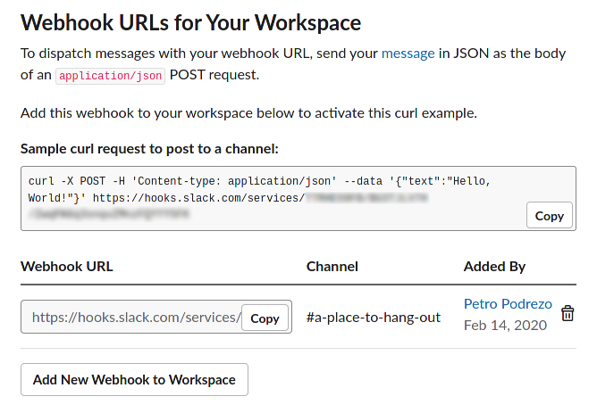
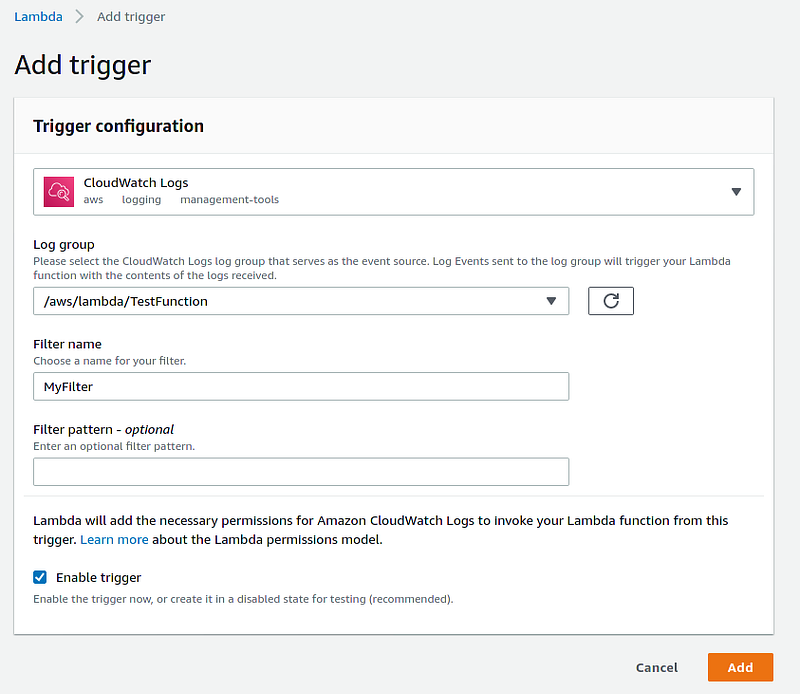
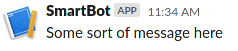

# Bot to post CloudWatch logs to a Slack channel using Ruby & AWS Lambda

We recently launched a new project at work that uses AWS’s “serverless” lambda functions and I wanted to see how simple it would be to leverage lambdas again to do some alerting around when our application encountered errors. When you print to standard output in a lambda (as is  [the recommended way](https://docs.aws.amazon.com/lambda/latest/dg/ruby-logging.html)  of logging by Amazon), it goes directly into a configured CloudWatch log group which you can then add an event trigger to in order to run a separate “alerting” lambda function. I wanted to see what it would take to make that work together with Slack to post a message to a channel when an error condition was detected in our application. Turns out, there’s not much to it!

### Setting up your Lambda

I’m not going to walk you through the steps here because you just need a basic lambda function set up. If you want to follow along with my code in this article you’ll need to select Ruby as your runtime but you should be able to do the same thing any of the other runtimes. Since the data flow for this use-case is unidirectional, that is: we want events in CloudWatch to post a Slack message, we don’t need to configure an API gateway to hit the lambda at this time as would be typical for many other lambda use-cases.


Function set up for AWS lambda

### Setting up a Slack bot

Go to the  [Slack API website](https://api.slack.com/apps)  and click “create new app.” You will need the proper permissions to actually add the app into your slack group so if you’re just trying things out you may not want to add it to your real one and instead create a new one as a sandbox. Once you’ve created your bot, you can configure the various parameters on this website like its name and icon; I’m going to call mine “SmartBot”. Once done, head over to the “Incoming Webhooks” section and activate it. For the purposes of this example, we’re going to send to a single channel so go ahead and add a hook for it and take note of the resulting URL.



Slack webhook screen

### Making your bot talk to your channel

The first main piece of this puzzle is getting our bot to speak, which is as simple as issuing an HTTP request to the endpoint from the previous section. Let’s make SmartBot say “hello”.

To do this, take that URL for the slack hook from earlier and store it in an environment variable named “SLACK_HOOK_URL”. Paste the following code into your function, save it , and hit “test” — the body of the test event doesn’t matter for now so you can leave the example provided.

```ruby
require 'json'
require 'net/https'
require 'uri'

def lambda_handler(event:, context:)
    response = speak("hello, slack!")
    puts response.body
end

def speak(message)
    http = Net::HTTP.new("hooks.slack.com", 443)
    http.use_ssl = true
    request = Net::HTTP::Post.new(ENV["SLACK_HOOK_URL"])
    request.body = JSON.generate({
        text: message
    })
    http.request(request)
end
```

You should see something similar to the following in your slack channel:


SmartBot says hello

### Responding to log events

Now that we can speak, let’s make the bot speak in response to actual events we care about such when CloudWatch logs something in a specific log group. Add a trigger for “CloudWatch Logs” to your lambda and point it to the log group you’re interested such as the output of another lambda. For fun, you can just make a new lambda that does nothing but write a single line of output to the console.

This should be obvious but  **do NOT point it at the log group for the bot's own lambda** as this will create a feedback loop where any event trigger will cause a runaway cyclical scenario and you'll probably burn through a very chunky portion of your AWS bill and probably be banned from Slack's API.



At this point events from that log group should start triggering your lambda. The  [shape of the event is documented here](https://docs.aws.amazon.com/lambda/latest/dg/services-cloudwatchlogs.html). Go ahead and add a new test event (or modify the existing one) with this example:

```json
{
  "awslogs": {
    "data": "H4sIAAAAAAAAA2WQwY7CIBCGz/QpCPG4CS2rUffWxOplPcFNmw3qrJIUaIBqjfHdt5B6MDvH/5v5ZuCRIaLBe3kGcW+BfGGyKkX5s604LzcV+Ri4vRlwkfSvSnFjzxtnuzYSKm+eNlIfTpIK8GHdmWNQ1rwaeXAgdexkOctpzmgxo7vJdykqLuq+fzf77uCPTrXRsFZNAOeH0R3Z3pM7JaQe1dUVTEj8kSFE1Ont0n8VFyAS1PDoIHU8vpgtijlbTD+XU8YSHT8kirjVgL11AdtfPOb4Ag72hmToWWfPP09hdZtCAQAA"
  }
}
```

As the documentation says, the “data” is a gzipped, base64 encoded JSON object that contains metadata and log messages. When you decode and decompress it, it has the following shape:

```json
{
 "messageType": "DATA_MESSAGE",
 "owner": "xxxxxxxxx",
 "logGroup": "/aws/lambda/TestFunction",
 "logStream": "2020/02/15/[$LATEST]xxxxxxxxxxx",
 "subscriptionFilters": ["MyTestFilter"],
 "logEvents": [{
  "id": "xxxxxxxxxxxxxxxxxxxxxxxxxx",
  "timestamp": 1581728439422,
  "message": "Some sort of message here\n"
 }]
}
```

So we’ll need a few more “requires” and to build a function to do the decoding and decompression. Moreover, we’ll want to add a function to process that JSON blob and extracts all the messages, ignoring all the other metadata (for our particular use case — you can obviously adjust it to suit your needs). Our code will now look like this:

```ruby
require 'json'
require 'net/https'
require 'uri'
require 'base64'
require 'zlib'
require 'stringio'

def lambda_handler(event:, context:)
  log_event = JSON.parse(decode_and_decompress(event["awslogs"]["data"]))
  response = speak(messages_from_blob(log_event))
  puts response.body
end

def speak(message)
  http = Net::HTTP.new("hooks.slack.com", 443)
  http.use_ssl = true
  request = Net::HTTP::Post.new(ENV["SLACK_HOOK_URL"])
  request.body = JSON.generate({
    text: message
  })
  http.request(request)
end

def decode_and_decompress(input)
  binary_compressed = Base64.decode64(input)
  gz = Zlib::GzipReader.new(StringIO.new(binary_compressed))
  gz.read
end

def messages_from_blob(event_data)
  event_data["logEvents"]
    .map{ |e| e["message"] }
    .join("\n")
end
```

So what do we get when we run the test event?



SmartBot has successfully decoded CloudWatch logs!

At this point you have the tools necessary to add any kind of filtering logic you may want and you’ll be able to do something a little smarter like respond to catastrophic failures in your lambda code by alerting your team automatically in Slack. Happy coding!
