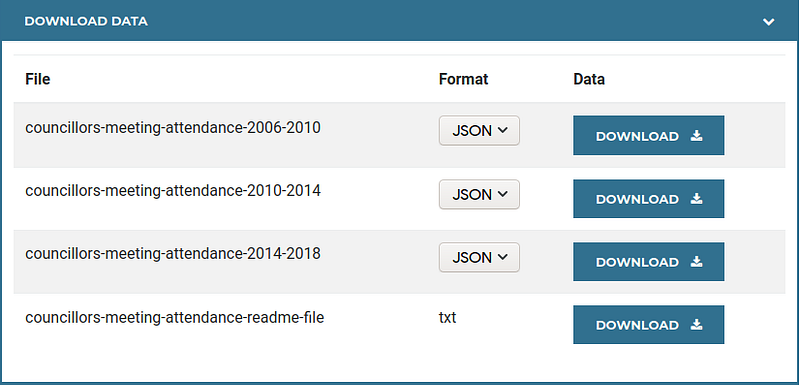
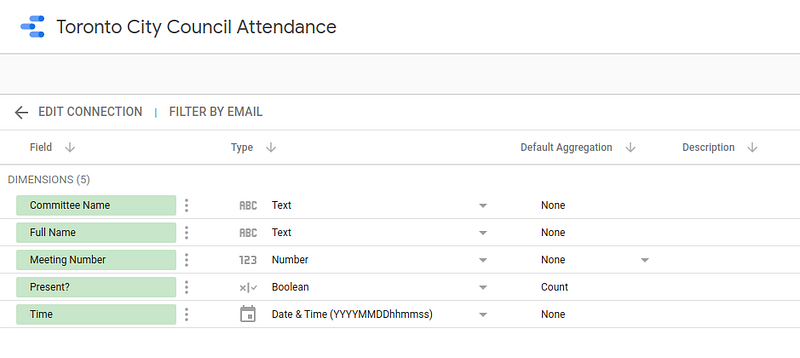
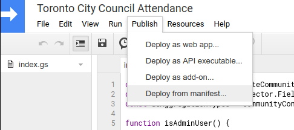
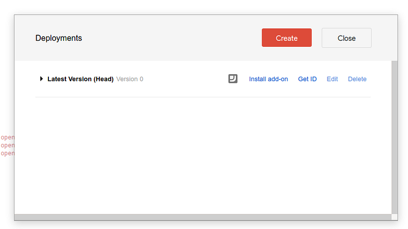
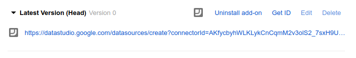
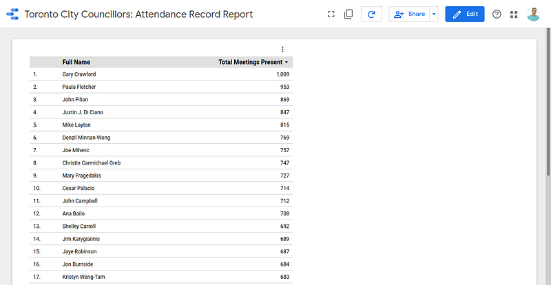
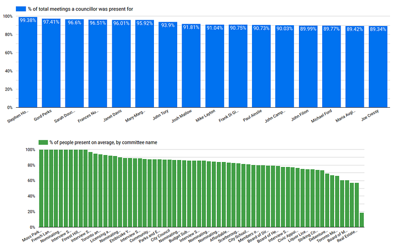
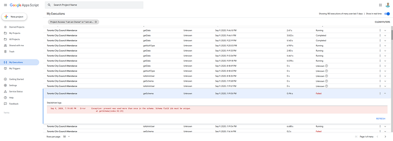

# Creating a Google Data Studio connector

I recently discovered a Google tool that I immediately took an interest in: Data Studio.  [According to Google](https://support.google.com/datastudio/answer/6283323?hl=en)  “Data Studio is a free tool that turns your data into informative, easy to read, easy to share, and fully customizable dashboards and reports.” For me the thing that makes Data Studio really stand out is a combination of it being free (unlike the very similar tools Tableau and Amazon QuickSight) and the fact that it is fairly easily extendable by means of community-built connectors and visualizations. While there is a fair amount of documentation from Google on how to build connectors already out there, I found that the documentation can be lacking critical details in many places and I spent countless hours trying to figure it out. In this article I am going to walk you through the process of building a connector from start to finish and show you many pitfalls that I spent a lot of time solving so you don’t have to.

----------
The one sentence summary of how you write a data studio connector is you have a handful of predefined functions that you have to write — essentially like implementing an interface. First thing’s first, we’ll need a data source.

Being a resident of Toronto, Canada I am going to apply this tutorial to building a connector to pull data from the super cool “[Toronto Open Data](https://open.toronto.ca/)” initiative which makes many interesting data sets freely accessible to the world. Specifically, we’re going to be pulling in the  [attendance records](https://open.toronto.ca/dataset/members-of-toronto-city-council-meeting-attendance/)  of Toronto city councillors. Note that in this particular case one can simply download the CSV formatted values, load it into Google Sheets, and connect Data Studio directly to that sheet without writing any code but the point of this article is to show you how to code the connectors so we’ll pretend that’s not the case.

If you want the full source code and don’t want to bother with the walk through, you can  [find it on GitHub gists](https://gist.github.com/podrezo/55619b3b442f5ab1460f75570274d1b7).

### Developing locally

Data Studio connectors are written as an “[Apps Script](https://developers.google.com/apps-script)” which is a method of extending Google cloud applications. App scripts are written in JavaScript and you can use them for many applications, not just Data Studio. You can create and manage your scripts at  [https://script.google.com/home](https://script.google.com/home)  where you will also be able to access an in-browser IDE to edit and publish your code. My recommendation is to not use this interface — the interface feels very clunky and can be quite buggy at times. Instead, Google offers a CLI tool called “[clasp](https://github.com/google/clasp)” that lets you create scripts and sync the code between your local machine and the “Apps Script” site. This gives you many advantages like being able to version control your code in Git, being able to use your favourite development environment, and most importantly it will give you the ability to write unit tests which can be very handy if your connector is not trivial. Follow the instructions in clasps’s readme to login with your Google account that you’ll be working on and enter your working directory for your connector. Create a new script like so:

```bash
clasp create --title "Toronto City Council Attendance"
```

You will be prompted for what kind of application to create — select “standalone”. The directory will now contain a “appsscript.json” file which is a manifest for apps scripts. It will also contain a “.clasp.json” file which simply has an ID that tells clasp which scripts project the current directory is linked to. If you open your Google scripts page, you should see your script in the list.


Let's modify our manifest file a bit; we’ll need to add some meta data about the data studio aspect of this script. Here’s the  [official docs](https://developers.google.com/datastudio/connector/build#complete_the_project_manifest)  for the data studio manifest but I’ll just leave an example of mine for this project:

```json
{
  "timeZone": "America/Toronto",
  "dependencies": {},
  "dataStudio": {
    "name": "Toronto City Council Attendance",
    "logoUrl": "https://i.imgur.com/e9wE7Md.png",
    "company": "Petro Podrezo",
    "companyUrl": "https://toronto.ca/",
    "addonUrl": "https://toronto.ca/",
    "supportUrl": "https://toronto.ca/",
    "shortDescription": "Toronto City Council Attendance",
    "description": "Attendance statistics for Toronto city councilors.",
    "authType": ["NONE"],
    "feeType": ["FREE"]
  },
  "exceptionLogging": "STACKDRIVER",
  "runtimeVersion": "V8"
}
```

Most importantly, note the last two lines: the property “exceptionLogging” tells Google to log to a special persistent store called Stack Driver instead of the ephemeral logs that it logs to by default. Furthermore, the “runtimeVersion” of “V8” allows you to use various ES6+ language features like classes, lambda functions, and more.

#### A note on working with multiple files

While it is possible to organize code into multiple files and make it easier to work with your application, one of my biggest annoyances with developing anything in apps scripts is that the way Google runs the apps script is that it effectively concatenates all the code files and runs it as one big file no matter what you do. This means that everything outside of functions and classes is automatically global, and even if using the V8 runtime you will be unable to use ES6 style import/export functionality — it will just crash your script. If you’re planning to write anything even remotely complicated into the connector itself, read the section below on “building complex connector code” before you do. For the purposes of this tutorial, we will do everything in the connector itself because it’s a simple use case and I’m primarily concerned with showing you how to build connectors themselves and not the supporting APIs.

### The interface

At it’s most basic, a data studio connector looks like this:

```javascript
function isAdminUser() { ... }
function getAuthType() { ... }
function getConfig(request) { ... }
function getSchema(request) { ... }
function getData(request) { ... }
```

Let’s start with the simpler stuff and move on from there.

### isAdminUser()

The simplest part of this whole experience is this function. It is used to  [enable or disable debugging features](https://developers.google.com/datastudio/connector/debug#enablingdisabling_debug_features). Despite it being listed as optional, you will see “FAILED” entries in your logs without implementing it so I’d recommend just filling it in. In production, you’d probably want to set this value based on some sort of criteria about the user but since we’re just developing based on a tutorial let’s return “true” so that we have all the debug info easily accessible all the time.

```javascript
function isAdminUser() {
  return true;
}
```

### getAuthType()

This function returns what authentication scheme we’re going to use. For our example we don’t need to be authenticated so the function body looks like this:

```javascript
const cc = DataStudioApp.createCommunityConnector();
function getAuthType() {
  const AuthTypes = cc.AuthType;
  return cc
    .newAuthTypeResponse()
    .setAuthType(AuthTypes.NONE)
    .build();
}
```

Notice the constant declaration “cc” — this can be put at the very top of your file because it will be referenced in many places. It references the Google API for Data Studio.

If for a real-world scenario you end up having an API that uses authentication, a useful thing to know is that unlike the connector configuration defined by “getConfig()”, the authentication is not accessible to viewers of reports once it is stored. Other authentication types  [include OAuth2, User & Password, and User & Token schemes](https://developers.google.com/datastudio/connector/reference#authtype).

### getConfig(request)

When you set up a data studio data source the first time you can optionally set some sort of configuration options. In our case, let's say we want to provide the user the option of picking which of the data sets they want to look at:



Toronto Open Data screenshot for meeting attendance

You can ignore the “request” parameter for the purposes of our tutorial because all it provides you is the language code of the user’s locale. Our connector will be in English only for simplicity. Let’s provide a dropdown box of three options:

```javascript
function getConfig(request) {
  const config = cc.getConfig();
  config
    .newSelectSingle()
    .setId('dataSetUrl')
    .setName('Period')
    .addOption(config.newOptionBuilder().setLabel('2006 - 2010').setValue('https://ckan0.cf.opendata.inter.prod-toronto.ca/download_resource/035afc79-7a6b-462a-85a4-ef7b7b14c403?format=json'))
    .addOption(config.newOptionBuilder().setLabel('2010 - 2014').setValue('https://ckan0.cf.opendata.inter.prod-toronto.ca/download_resource/191a6bf8-038e-4269-8672-d236bc13318b?format=json'))
    .addOption(config.newOptionBuilder().setLabel('2014 - 2018').setValue('https://ckan0.cf.opendata.inter.prod-toronto.ca/download_resource/129dffc6-f820-422d-b23c-6469c4325dff?format=json'));

  config.setDateRangeRequired(false);
  config.setIsSteppedConfig(false);

  return config.build();
}
```

The configuration can get pretty advanced as you can use a multi-stepped configuration process and and various types of controls into it. For details on that, see  [the official docs](https://developers.google.com/datastudio/connector/reference#getconfig). One thing to note is the “setDateRangeRequired” field — if set to true then this allows the user to specify a date range that is of interest to them. It is really handy for generating reports that only need a sub-section of the timeframe that is offered by the data set and allows users to zero-in on periods that are of interest to them. For this tutorial we’re going to keep it a bit simpler and set it to false.

### getSchema(request)

This function returns the full list of columns and the columns’ data types. It is called whenever the connector is configured so that Data Studio knows what is available to it from a data source that uses this connector. Here’s what that looks like when you’re adding a data source using this connector to your report:



The “request” parameter will be an object containing a property “configParams” which is a key-value map of the configuration properties. The keys will be the values passed to “setId” in the “getConfig” function, and the value will be the value set by the user. In our case, the request will look something like this:

```json
{
  "configParams": {
    "dataSetUrl": "https://some.url/"
  }
}
```

In our case, the columns will be the same regardless of the data set so we don’t need to do anything with the request parameter. In more advanced reports you may need to return a different schema depending on certain options the user sets.

Our data has the following shape:

```json
{
    "Session Start-End Time": "09:44AM - 12:30PM",
    "MTG #": 123,
    "Last Name": "Smith",
    "First Name": "John",
    "Committee": "City Council",
    "Session Type": "Morning",
    "_id": 9999,
    "Session Date": "2009-12-08T00:00:00",
    "Present": "Y"
}
```

But our schema is going to look like this:

-   The full name of the councillor
-   The session date and time (we will use the start time only)
-   The name of the committee
-   The meeting number
-   Whether the councilor was present

We will need to re-format the data in the getData() method to fit this schema in our connector code. The rest of the fields we will ignore for the purposes of this tutorial as they’re not too interesting (such as the session end time).

Add the following constants to the top of your connector code, we’ll need them in a moment:

```javascript
const dsTypes = cc.FieldType;
const dsAggregationTypes = cc.AggregationType;
```

Before we proceed with just returning all the columns in the schema though, we must think ahead a bit — the “getData()” method also needs to return the schema for the specific data request it is executing so ideally we’d like to share the code that getSchema() and getData() use towards this end using a helper method that returns one particular field based on its ID.

Here’s my take on this; one important thing to note is that the “fields” object passed in requires all the operations to be done as a chain, therefore we accept the fields object as a parameter, call the methods to add the field, then return “fields” so that the caller can re-use that object for the next field it wants to add.

```javascript
// https://developers.google.com/datastudio/connector/reference#datatype
function _getField(fields, fieldId) {
  switch (fieldId) {
    case 'fullName':
      fields
        .newDimension()
        .setId('fullName')
        .setName('Full Name')
        .setType(dsTypes.TEXT);
      break;
    case 'sessionDatetime':
      fields
        .newDimension()
        .setId('sessionDatetime')
        .setName('Time')
        .setType(dsTypes.YEAR_MONTH_DAY_SECOND);
      break;
    case 'committeeName':
      fields
        .newDimension()
        .setId('committeeName')
        .setName('Committee Name')
        .setType(dsTypes.TEXT);
      break;
    case 'meetingNumber':
      fields
        .newDimension()
        .setId('meetingNumber')
        .setName('Meeting Number')
        .setType(dsTypes.NUMBER);
      break;
    case 'present':
      fields
        .newMetric()
        .setId('present')
        .setName('Present?')
        .setType(dsTypes.BOOLEAN)
        .setAggregation(dsAggregationTypes.COUNT);
      break;
    default:
      throw new Error(`Invalid fieldId: ${fieldId}`)
  }
  return fields;
}
```

And here’s getSchema() itself which is rather lightweight after extracting the logic for getting each individual field:

```javascript
function getSchema(request) {
  let fields = cc.getFields();
  ['fullName', 'sessionDatetime', 'committeeName', 'meetingNumber', 'present'].forEach(fieldId => {
    fields = _getField(fields, fieldId);
  });
  fields.setDefaultMetric('present');
  fields.setDefaultDimension('fullName');
  return { 'schema': fields.build() };
}
```

Most notably, notice that we must enumerate all the fields that we want to have available in the data source.

### getData(request)

We’re almost at the finish line for the coding part — we need to actually fetch the data from the API and return the data as well as the corresponding data type for the returned column(s). A crucial detail to know here is that getData() will be called once for every single chart/control you have in your report that uses this data source. The way Data Studio works is that in your chart you select which fields you’re interested in working with for that particular control and then getData will provide a “request” object with those fields specified in the object. The body of the method is expected to return exactly those fields and in exactly the order that was requested.

_Important side note:_  If the API you are accessing rate limits requests or takes a long time to respond it will be very difficult to continue without abstracting the API away and adding a caching layer. As a side note, in my own personal project to connect Data Studio to Jira’s API, I originally intended to do all the computation in the connector itself and not have any caching since the API wasn’t rate limited but even with a simple report that had only 7 charts it was unbearably slow to refresh the data because every request would have to churn through roughly 700 records, paginated by 100 items, meaning that I’d be making about 50 API calls every single time a single detail in the report changed. I settled on using an AWS lambda function coupled with S3 to do the heavy lifting and merely use the connector code as an interface between my logic code and the data studio UI.

In our case, we’re going to ignore the need for caching and do the simple thing — fetch the data directly from the source. To do this we can use “[UrlFetchApp](https://developers.google.com/apps-script/reference/url-fetch)” which is an Apps Script runtime API to allow talking to HTTP servers. I’m going to run through the code block by block to explain what’s going on rather than putting the whole function all at once. First, we need to understand what fields we are actually being requested to provide:

```javascript
function getData(request) {
  let fields = cc.getFields();
  const fieldIds = request.fields.map(field => field.name);
  fieldIds.forEach(fieldId => {
    fields = _getField(fields, fieldId);
  });
  // ... continued ...
```

Next, we want to issue the HTTP request to the API (don’t forget that the URL is passed from the config!). Note the “muteHttpExceptions” flag is set to true — this is because if the API call fails (e.g. we hit a 500 error for example) then the UrlFetchApp will raise an exception which will then show users a generic “Failed to fetch data” message (if debugging mode is off). This is not an ideal user experience so instead we’ll do something better with it which is log the response code, headers, and body first. Moreover, we’d like to show a more useful error message to the user — we’ll get to that part later (for now we’ll just throw an exception, the message of which will not be shown to the user).

```javascript
  const requestOptions = {
    muteHttpExceptions: true,
    method: 'get'
  };
  const url = request.configParams.dataSetUrl;
  const httpResponse = UrlFetchApp.fetch(url, requestOptions);
  // handle errors from the API
  if(httpResponse.getResponseCode() !== 200) {
    Logger.log('An exception occurred accessing the API:');
    Logger.log(httpResponse.getResponseCode());
    Logger.log(httpResponse.getAllHeaders());
    Logger.log(httpResponse.getContentText());
    // TODO: Return an error to the user
    throw new Error(`The API replied with an unsuccessful status code of ${httpResponse.getResponseCode()}`);
  }
  const data = JSON.parse(httpResponse.getContentText());
```

Next, we need to formulate the “data” part of our return value; here I suggest using another helper method — in my case I named it “_getDataField” which accepts the data point (e.g. the specific discrete entity for which the row is being generated) as well as which field ID we want and returns the value which may be computed using multiple properties on that entity:

```javascript
  const rows = data.map(dataPoint => {
    return {
      values: fieldIds.map(fieldId => _getDataField(dataPoint, fieldId))
    };
  });
```

And finally we return our result:

```javascript
  const result = {
    schema: fields.build(),
    rows: rows
  };
  return result;
}
```

Here’s the helper method to get the value based on the field ID and entity:

```javascript
function _getDataField(entity, fieldId) {
  switch (fieldId) {
    case 'fullName':
      return `${entity['First Name']} ${entity['Last Name']}`;
    case 'sessionDatetime':
      let year, month, day, hour, hour24, ampm, minute;
      [_, year, month, day] = /^(\d{4})-(\d{2})-(\d{2})/.exec(entity['Session Date']);
      [_, hour, minute, ampm ] = /^(\d{2}):(\d{2})(\w{2})/.exec(entity['Session Start-End Time']);
      hour24 = ampm === 'PM' ? (parseInt(hour) + 12).toString() : hour;
      // YYYYMMDDHHMMSS
      return `${year}${month}${day}${hour24}${minute}00`;
    case 'committeeName':
      return entity['Committee'];
    case 'meetingNumber':
      return entity['MTG #'];
    case 'present':
      return entity['Present'] === 'Y';
    default:
      throw new Error(`Invalid fieldId: ${fieldId}`)
  }
}
```

### Deploying the connector

Open your  [Google Scripts](https://script.google.com/home)  interface and find your project in the list. Go to "Open Project" to open the online IDE. Go to "Publish" and then "Deploy from manifest…"



Click "Install add-on"



Expand the "Latest Version" and click on the link below.



You will see the following interface that will ask you to authorize the code to execute in the context of data studio.


Unless your code is not talking to external systems (e.g. Web APIs) you should see an additional popup appear that asks you to confirm that you’re allowing this code additional permissions. If you authorize it and then end up needing more permissions later, you may not see any errors and will spend a lot of time trying to figure out what’s wrong. See the “Apps scripts use Google OAuth permissions” section below for more details.


Finally you’ll see all the possible fields you can get using this data source. You can now add the data source and begin using it.

After adding the data source to a report, we can generate a simple pivot table:



Stats shown for 2014–2018 period

Or go crazy and add a bunch of charts!



Stats shown for 2014–2018 period

I hope you enjoyed this tutorial. There’s a lot of useful additional info below but you should now have the fundamentals.

### Additional Tips & Pitfalls

Here’s a few more tips that you may find useful.

#### Logging & Exceptions

To see your log outputs and stack traces you can visit the Google Scripts interface, click your script, and go to "My Executions" on the sidebar.



#### Apps scripts use Google OAuth permissions

This was painful to debug because there was no error messages for it, but you should be aware that apps scripts are limited in scope in what they can access. If you need to access an external service (like hitting a web API) the script will need to have that permission granted to it when it is added to Data Studio. There is no place to define which scopes you need — Google will automatically pick up what permissions the script needs at the time you add it to Data Studio. Unfortunately, there isn’t really a clear indication of this and there’s no way to refresh the permissions so if you add the connector into Data Studio before you actually use that scope then when you do start accessing APIs your script will just fail with no indication as to what went wrong. If this happens, you need to remove the connector and then add it again.


Notice the "Connect to an external service" permission since we are using "UrlFetchApp"

#### Sharing your connector with others

When you develop your connector, it will be accessible to your own Google account only. It will show up in the gallery of community connectors for you only. You can then “share” your script with individuals or your organization to let them run the connector without exposing it to the world. To do so, go to the scripts interface and click the “share” button same as you would for a Google Drive document. If you want to, you can submit your connector to Google for review to be added to the public list of connectors available to the world.

#### Storing Authentication Values

If you use a data source that requires storing credentials, such as a username and password then you’ll need to store those values as they should not be part of the connector’s configuration (since that configuration data is visible to editors of the report). Google provides the  [PropertiesService](https://developers.google.com/apps-script/reference/properties/properties-service)  to do just that. The properties service is a key-value store that has three possible vaults: document, script, and user. For data studio connectors you will almost definitely want the user properties which you can get, set and delete like so:

```javascript
const userProperties = PropertiesService.getUserProperties();
userProperties.setProperty('myservice.username', username);
const username = userProperties.getProperty('myservice.username');
userProperties.deleteProperty('myservice.username');
```

You can use this in the resetAuth() and setCredentials() methods for example.

#### Sending better error messages to the user

If you want to show an error message to the end-user in Data Studio that’s consuming the report, such as in the case where the API call failed and you know the reason why (like perhaps the credentials are wrong) you can do so quite simply with this handy helper method:

```javascript
function sendUserError(message) {
  cc.newUserError()
    .setText(message)
    .throwException();
}
```

Now you can just call this method with a message and it will be displayed directly to the user in a modal window.

#### Adding unit tests for data studio connectors

When I initially tried to add some unit tests for my project, I got stuck because almost all the methods in the Data Studio API are chained methods and really hard to mock, as well as using lots of globals. My colleagues recommended this article called “[Don’t Mock What You Don’t Own](https://github.com/testdouble/contributing-tests/wiki/Don%27t-mock-what-you-don%27t-own)” and it made a huge difference for me here so I’d highly recommend it.

The gist is since we do not control the data studio API, try to abstract it away in a way that is meaningful to your own code that interacts with it then mock that interface.

#### Building complex connector code

I strongly recommend to keep your connector as “dumb” as possible and do as much as possible in an external system like in a serverless function for many reasons including performance, ease of maintenance, readability, and more. If you absolutely must build all your connector logic into the connector itself then you’ll probably run into a wall when you try to add unit tests and use multiple files. The problem being that Data Studio does not support imports/exports and instead treats all your files as one steaming hot pile of concatenated mess. To this end, while I don’t recommend it, you can use good old “gulp” to get this done. The way I managed to get this to work is to use require() and module.export as usual, and consume those separate files using  [jest](https://jestjs.io/)  like any normal project but before deploying to Google I’d run a gulp script that removes all the imports by surrounding relevant lines with this:

```javascript
//removeIf(production)
const Schema = require('../lib/schema');
//endRemoveIf(production)
```

Then in your gulpfile you can use the plugin “gulp-remove-code”

```javascript
const removeCode = require('gulp-remove-code');
const concat = require('gulp-concat');
const run = require('gulp-run-command').default;

const { series, src, dest } = require('gulp');

function copyManifest() {
  return src('appsscript.json')
    .pipe(dest('./dist/'));
}

function build(cb) {
  return src(['./google/**/*.js', './lib/**/*.js'])
    .pipe(removeCode({ production: true }))
    .pipe(concat('all.js'))
    .pipe(dest('./dist/'));
}

exports.default = series(copyManifest, build, run('clasp push'));
```

This will build the production version of your code into the “dist” directory and also run “clasp push” for you to deploy it.

### Further Reading

-   [Google’s official reference guide](https://developers.google.com/datastudio/connector/reference)
-   [Google’s official developer guide](https://developers.google.com/datastudio/connector)
-   [Data Studio connector examples repository](https://github.com/googledatastudio/community-connectors)
-   [Google’s official walk-through of developing a connector](https://codelabs.developers.google.com/codelabs/community-connectors)
